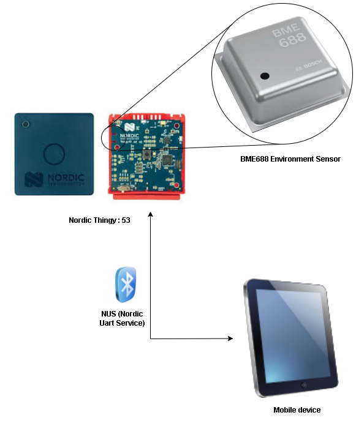

# Project-Carl

## Summary
**Project Carl** is name after a Swedish biologist and physician *Carl Linnaeus*, also known after ennoblement in 1761 as Carl von Linné man is widely acknowledged as the **“Father of Modern Botany"**

This project addresses the Plant health monitoring need using a IOT based product. Scope of this project is limited by the hardware and more focused on to the Firmware of the hardware.

The system is shown below. TBD - more details



### Hardware used

- [Nordic Thingy:53](https://www.nordicsemi.com/Products/Development-hardware/Nordic-Thingy-53)
    - [BME688](https://cdn.shopify.com/s/files/1/0174/1800/files/bst-bme688-ds000.pdf?v=1620834794) | Digital low power gas, pressure, temperature & humidity sensor
- [Grove - Capacitive Moisture Sensor](https://wiki.seeedstudio.com/Grove-Capacitive_Moisture_Sensor-Corrosion-Resistant/)

## Clone the Application
To clone the application, follow these steps:

1. Open a terminal or command prompt.
2. Navigate to the directory where you want to clone the application.
3. Run the following command to clone the repository:

    ```bash
    git clone https://github.com/manu897/Project-Carl.git
    ```

    or:

    ```bash
    git clone git@github.com:manu897/Project-Carl.git
    ```

##  Building & Running

### Windows 11 (Home Edition) --> Build with VSCode

#### Install module
* [nRF SDK 2.5.99-dev](https://developer.nordicsemi.com/nRF_Connect_SDK/doc/2.5.99-dev1/nrf/installation.html)

1. Open project in VSCode
2. Select nRF Connect on VSCode
3. Build the application for board
```
$ thingy53_nrf5340_cpuapp_ns
```
4. Flash the build on to the Thingy:53, click [here](https://academy.nordicsemi.com/flash-instructions-for-the-thingy53/) for instructions.
5. Open COM port under 115200 baud rate, putty.

### MacOS Sonoma 14.5 --> Build with West

After cloning the application, you need to update it using West. Here's how:

1. Open a terminal or command prompt.
2. Navigate to the cloned repository directory.
3. Run the following command to set the python env workspace:
    ```python
    python3 -m venv path/to/venv

    source path/to/venv/bin/activate
    ```
4. Run the following command to set the west env workspace:
    ```bash
    west init -l application
    ```
5. Run the following command to update the repository:

    ```bash
    west update
    ```

    You might be asked to provide credentials for the ASD Lighting repos, as these are private.
6. Prepare your environment by sourcing the zephyr config:
	```bash
	source external/zephyr/zephyr-env.sh
	```
7. Run he following command to build the script:
    ```bash
	west build ./application -b thingy53_nrf5340_cpuapp_ns
	```

## Flashing

Run the following command to flash the device:

```bash
west flash
```
NOTE: prior flashing the device, it is suggested to fully erase the device by running the related nrfjprog command:

```bash
nrfjprog -e
```

## Code file Structure

```
* src
    |__ main.c
            |__ bme688_interface.c
            |__ bme688_reg.h
            |__ ble.c
            |__ ble.h
* CMakeLists.txt
* prj.conf
* thingy53_nrf5340_cpuapp_ns.overlay
```

# Build & Test Status

Windows 11 home edition


Linux(Ubuntu 22.0.2)


MacOs Sonoma 14.5 (23F79)


## Author

[Manideep Reddy Tamma](mailto:manideep@bioliberty.co.uk) | [LinkedIn](https://www.linkedin.com/in/manideep-reddy-tamma/)

## Reference

* [nRF Connect SDK Fundamentals](https://academy.nordicsemi.com/courses/nrf-connect-sdk-fundamentals/)
* [Nordic Thingy: 53 Datasheet](https://infocenter.nordicsemi.com/pdf/Thingy53_UG.pdf)
* [BME688 DataSheet](https://www.bosch-sensortec.com/media/boschsensortec/downloads/datasheets/bst-bme688-ds000.pdf)
* [nRF Connect for Desktop](https://www.nordicsemi.com/Products/Development-tools/nRF-Connect-for-Desktop)
* [putty](https://www.putty.org/)
* [Soil Moisture selection](https://metergroup.com/measurement-insights/soil-moisture-sensors-how-they-work-why-some-are-not-research-grade/)